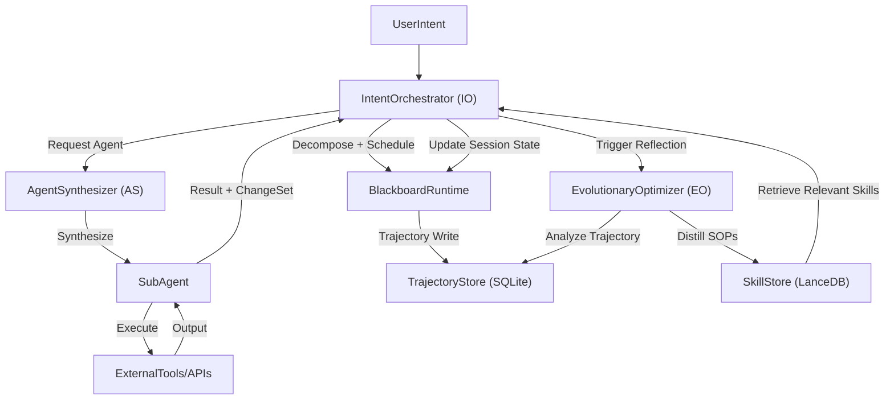
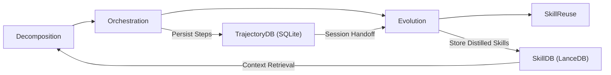

# agents021: Trinity Multi-Agent System

A modern, autonomous multi-agent system built on the **Trinity Architecture**:
- **IntentOrchestrator (IO)**: The "nO Master Loop" that manages task decomposition and execution.
- **AgentSynthesizer (AS)**: Dynamically assembles and arms sub-agents based on task requirements.
- **EvolutionaryOptimizer (EO)**: Distills successful execution trajectories into reusable semantic skills (SOPs).

## 🚀 Features

- **Dynamic Task Decomposition**: Uses reasoning models (DeepSeek-R1) to break down complex intents.
- **Runtime Replanning**: Streams planner output into the live execution queue so the system can inject validated tasks during execution, not only from the initial upfront plan.
- **Shared Memory (Blackboard)**: Context-aware execution with a centralized state manager.
- **Self-Evolving**: Post-execution reflection automatically creates new SOPs for future tasks.


## 🛠️ Installation

1. Install `uv` if you haven't: `curl -LsSf https://astral.sh/uv/install.sh | sh`
2. Clone the repository and sync dependencies:
   ```bash
   make install
   ```
3. Set up your environment:
   ```bash
   cp .env.example .env
   # Edit .env with your DEEPSEEK_API_KEY
   ```

## 📖 Usage

Run a task using the CLI:
```bash
uv run trinity run "Analyze the performance of the latest NVIDIA GPUs and summarize the findings into a markdown report."
```

Run without interactive plan review:
```bash
uv run trinity run "Your intent here" --review false
```

Start interactive chat (REPL mode):
```bash
uv run trinity chat
```

Continue an existing session:
```bash
uv run trinity chat --session-id <session_id>
```

Health check:
```bash
uv run trinity doctor
```

List persisted sessions:
```bash
uv run trinity list-sessions --limit 20
```

Validate rollout gates from KPI report (CI friendly):
```bash
uv run trinity rollout-status --report-path evals/kpi_report.json
```

Or via Makefile:
```bash
make run intent="Analyze the performance of the latest NVIDIA GPUs and summarize the findings into a markdown report."
```

## 🧪 Development

- **Formatting**: `make format`
- **Linting & Type Checking**: `make lint`
- **Tests**: `make test`

## 📂 Project Structure

- **`core/`**: System logic (Orchestrator, Synthesizer, Memory, CLI).
- **`data/`**: Local runtime databases (SQLite, LanceDB). *Ignored by Git.*
- **`artifacts/`**: Generated reports and agent outputs. *Ignored by Git.*
- **`evals/`**: Evaluation scripts for system performance.
- **`docs/`**: Technical documentation and system design.
- **`tests/`**: Unit and integration test suites.

## 🏗️ Architecture

The system is built on the **Trinity Architecture**, focusing on modularity and evolution. For a deep dive into the design, components, and data models, see the [Software Design Document (SDD)](docs/SDD.md).

### High-Level Component Interaction
This diagram shows how IO, AS, EO, and runtime boundaries interact during execution.



### Execution Lifecycle
This lifecycle summarizes the runtime loop and where persistence feeds future runs.



### Core Components
- **IntentOrchestrator (IO)**: Composition root for decomposition, scheduling, and execution boundaries.
- **AgentSynthesizer (AS)**: Dynamic factory that assembles and arms sub-agents on demand.
- **EvolutionaryOptimizer (EO)**: Reflection engine that distills successful trajectories into reusable semantic skills (SOPs).
- **Blackboard Runtime**: In-memory session state plus separate persistence adapters for trajectory and skills.

### Runtime Guarantees
- Trajectory data is persisted durably and is available for EO reflection at session handoff.
- Task scheduling preserves `depends_on` and `required_keys` semantics.
- Execution is not bound to a fixed upfront plan; planner outputs are stream-validated and enqueued at runtime, so `todo_list` can grow while the loop is running.
- Change application supports deterministic merge policies: `overwrite`, `append`, and `semantic_merge`.
- `get_context(..., filter_query=...)` supports query-based context filtering.
- `trinity list-sessions` lists recent persisted session IDs.
- `trinity rollout-status` enforces observe/soft/hard promotion checks via `evals/kpi_report.json`.

### Technical Stack
- **Framework**: Built on `Agno` (formerly Phidata).
- **LLMs**: Optimized for DeepSeek-R1 (Reasoning) and DeepSeek-V3 (Chat).
- **Storage**: SQLite for trajectories and LanceDB for vector-based skill memory.

