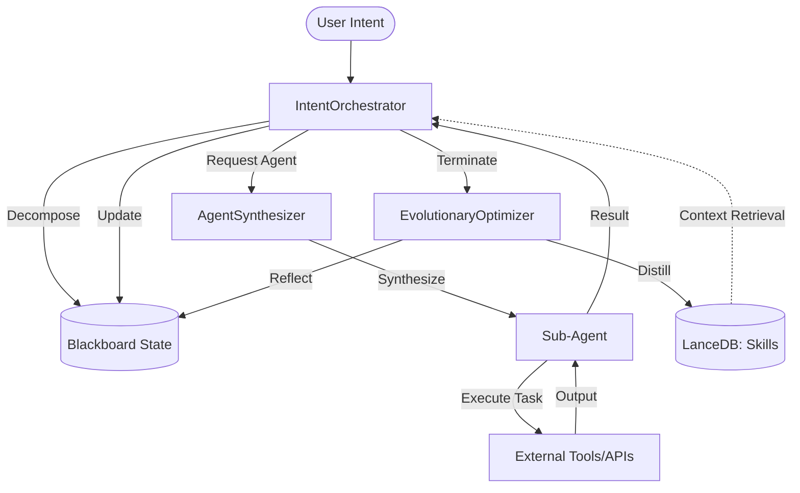

# Software Design Document (SDD): Trinity Multi-Agent System

## 1. Introduction
The Trinity Multi-Agent System is an autonomous framework designed for complex task decomposition, context-aware execution, and self-evolution. It leverages the "Trinity Architecture" to ensure reliability, extensibility, and continuous performance improvement through skill distillation.

### 1.1 Purpose
This document provides a detailed technical overview of the system's architecture, components, data models, and interaction flows to guide developers and maintainers.

---

## 2. System Architecture
The system is built on three core pillars:
1.  **IntentOrchestrator (IO)**: The "nO Master Loop".
2.  **AgentSynthesizer (AS)**: Dynamic agent factory.
3.  **EvolutionaryOptimizer (EO)**: The reflection and distillation engine.

### 2.1 High-Level Interaction Diagram

---

## 3. Component Design

### 3.1 IntentOrchestrator (IO)
The IO is the central controller of the system. It owns the orchestration event loop and delegates behavior to focused runtime boundaries (planner, scheduler, task executor, and EO trigger).

-   **Decomposition**: Uses high-reasoning models (e.g., DeepSeek-R1) to break down the `original_intent` into a list of `AtomicTask` objects.
-   **Execution Loop**:
    -   **Sequential Mode (Legacy)**: Historical design where tasks were executed one-by-one.
    -   **Branch-and-Merge Engine (Current Design)**: A concurrency-aware scheduler that executes ready tasks in isolated workspaces and merges results back into global state. Supports dependency-based and key-aware scheduling.
-   **Safe Run Pattern**: Implements centralized error handling, retries, and model fallbacks (e.g., falling back from `deepseek-reasoner` to `deepseek-chat` upon API instability).

### 3.2 AgentSynthesizer (AS)
The AS decouples task requirements from specific agent implementations.

-   **Dynamic Template Loading**: Uses `importlib` to load agent templates from `core.agents.templates` based on requested capabilities (e.g., `search`, `python_execution`).
-   **Context Injection**: Injects task-specific context directly into the agent's instructions during synthesis.

### 3.3 EvolutionaryOptimizer (EO)
The EO enables the system to "learn" from its own successes and failures.

-   **Trajectory Analysis**: Retrieves the execution history (Trajectory) from the persistence layer.
-   **Reflection Engine**: Uses an LLM to identify successful patterns and distill them into Generalized Standard Operating Procedures (SOPs).
-   **Skill Distillation**: Converts trajectories into `Skill` objects and stores them in LanceDB with vector embeddings for future retrieval during the decomposition phase.

### 3.4 Runtime Boundary Contracts
Current runtime composition separates concerns into explicit boundaries:
-   **State Boundary**: In-memory session state and scheduling metadata.
-   **Trajectory Boundary**: SQLite trajectory persistence adapter.
-   **Skill Boundary**: LanceDB skill retrieval/persistence adapter.
-   **Evolution Boundary**: EO trigger and reflection lifecycle.

---

## 4. Data Models

The system uses Pydantic for strict schema enforcement.

### 4.1 Core Models (`core/models.py`)
-   **AtomicTask**: Defines a single unit of work (ID, description, capabilities, context keys, and **depends_on** task IDs).
-   **SubAgentResult**: Captures output, status, and structured artifacts.
-   **TrajectoryStep**: Links a task to its result with a timestamp.
-   **Skill**: Represents a distilled SOP with a title, description, and markdown content.
-   **GlobalState (Blackboard)**: The source of truth for a session, containing the TODO list, completed tasks, shared memory, and trajectory.

---

## 5. Data Flow & Interaction

### 5.1 The Lifecycle of an Intent
1.  **Decomposition Phase**:
    -   IO fetches relevant `Skills` from LanceDB using the `original_intent`.
    -   Planner Agent generates an `IOPlan` (list of `AtomicTask`).
2.  **Orchestration Phase**:
    -   For each task, IO extracts `context_keys` from `shared_memory`.
    -   AS provides a `SubAgent` armed with the required tools.
    -   `SubAgent` execution results are stored back into `shared_memory`.
3.  **Evolution Phase**:
    -   Upon loop completion, EO is triggered.
    -   EO analyzes the `Trajectory` and extracts new `Skills`.
    -   New `Skills` are persisted to LanceDB for use in future sessions.

---

## 6. Persistence Layer

### 6.1 Trajectory Storage (SQLite)
Used for structured, relational storage of execution steps during and after a session.
-   **Table**: `trajectories` (session_id, step_id, task_json, result_json).

### 6.2 Semantic Memory (LanceDB)
Used for vector-based retrieval of distilled skills.
-   **Table**: `skills` (id, title, description, content_markdown, vector).

---

## 7. Future Considerations
-   **Multi-Step Reflection**: Allowing EO to perform deeper analysis over multiple sessions.
-   **Advanced Safety Gating**: Implementing a dedicated "Safety Agent" within the IO loop to inspect sub-agent outputs.

---

## 8. Parallel Execution Design

To optimize execution latency, the system supports concurrent task processing.

### 8.1 Branch-and-Merge Architecture
To optimize execution latency without sacrificing state integrity, the system implements a **Branch-and-Merge** strategy.

1.  **Isolated Workspaces**: Every parallel task operates on a read-only snapshot of the Blackboard context.
2.  **Change Sets**: Instead of direct writes, Sub-Agents return a proposed `ChangeSet`.
3.  **MergeGate**: The IO loop applies `ChangeSets` atomically. Current production behavior supports deterministic policies (`overwrite`, `append`). `semantic_merge` is an extension point and currently falls back to overwrite semantics unless explicitly implemented.

### 8.2 Dynamic Key-Aware Scheduling
Beyond static DAG dependencies (`depends_on`), the system supports **Key-Aware Scheduling**:
- A task is launched only when its `required_keys` are available and valid in the Blackboard.
- This allows for "Emergent Dependencies" where the exact data requirements are discovered during orchestration.

### 8.3 Causal Trajectory Reconstruction
To ensure the `EvolutionaryOptimizer` can learn from parallel runs, the system records **Causal Metadata**:
- Each execution step includes pointers to its logical parents and siblings.
- This allows the EO to reconstruct a deterministic, logical SOP from a non-deterministic parallel execution log.
