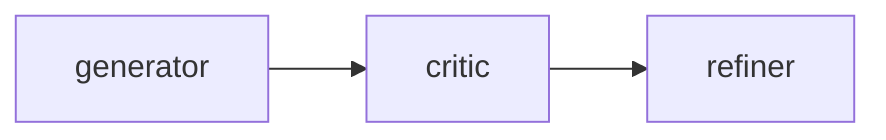
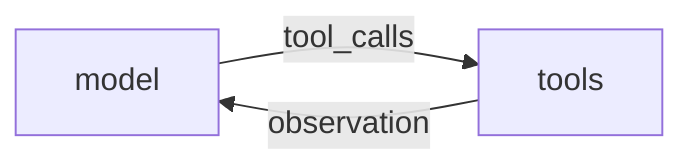
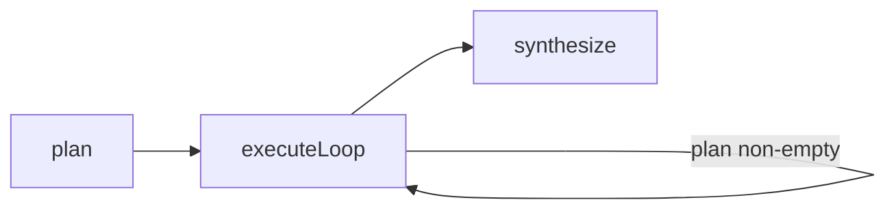
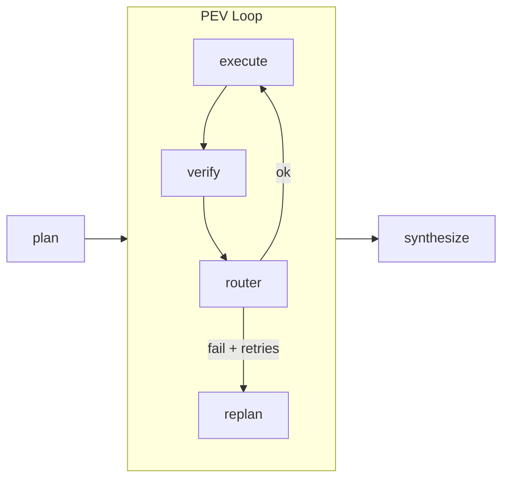
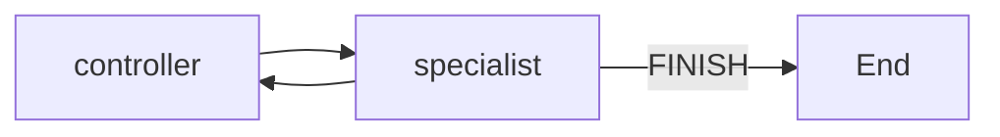
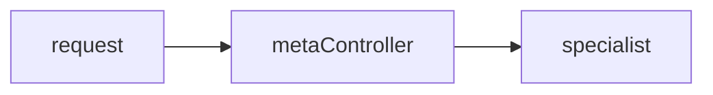
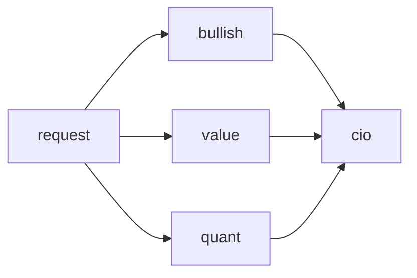
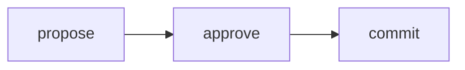
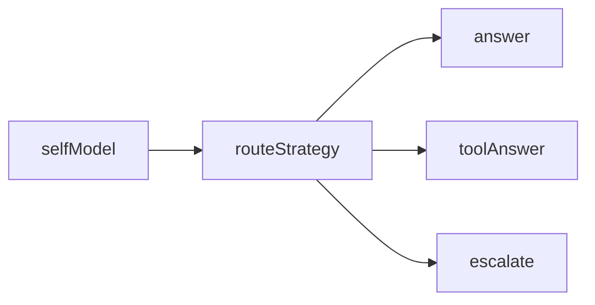

# 17 Agent 架构演进：控制流设计参考

> **Source:** [从0开发大模型的17种Agent架构演进详细拆解](https://mp.weixin.qq.com/s/5f0I2apY4oFsHrttANBOJg)  
> **Author:** linkxzhou（公众号《周末程序猿》）  
> **Based on:** [all-agentic-architectures](https://github.com/FareedKhan-dev/all-agentic-architectures)（原文 LangChain/LangGraph 实现；本文 agno 重写）

## 核心观点

Agent architecture 的本质不是 prompt engineering，也不是某个框架的 DSL，而是**控制流设计**。它应该能在任何体面的 agent 框架里复现。

决定 agent 系统能否落地的，通常不是模型回答够不够好，而是：

- 状态有没有被正确建模
- 控制流有没有被显式表达
- 错误能不能被局部截断
- 副作用能不能被关进闸门
- 系统知不知道自己什么时候该停

演化路径概览：

- 从**单次生成**到**反思闭环**
- 从**反思闭环**到**工具交互**
- 从**工具交互**到**观察-行动循环**
- 从**局部决策**到**显式规划**
- 从**无验证执行**到**验证驱动重规划**
- 从**单 agent**到**多 agent 编排**
- 从**短期上下文**到**长期记忆系统**
- 从**线性推理**到**搜索、模拟与涌现计算**
- 从**能做事**到**可信任**

所谓「agent 架构演化」，不是追求 AGI，而是：**怎样让系统在更复杂的环境里，依然保持可控、可解释、可恢复。**

---

## 统一分析框架（六个固定问题）

后面每一种架构，都用同一套问题拆解：

1. **它要解决什么问题？** — 上一代架构哪里不够。
2. **它的 State 是什么？** — 新增了哪些字段，为什么必须存在。
3. **它的拓扑是什么？** — 线性链、循环、分叉汇聚、共享黑板、树搜索还是网格涌现。
4. **它的 Router 怎么工作？** — 固定边、条件边、动态调度、验证回路、人工审批。
5. **它的失败模式是什么？** — 架构最容易在哪个环节坏掉。
6. **什么时候该升级到下一种？** — 当前模式的能力边界在哪里。

---

## agno 最小抽象

几乎所有架构都能被 agno 的几个抽象表达清楚：

```python
from agno.agent import Agent
from agno.models.openai import OpenAIChat
from agno.workflow.v2 import Workflow, Step, Router, Loop

# 一个最简 Agent = 一次状态变换
agent = Agent(
    model=OpenAIChat(id="gpt-5-mini"),
    tools=[...],
    instructions="...",
    response_model=SomePydanticModel,  # 结构化输出
)

# 一个 Workflow = 显式控制流
wf = Workflow(
    name="my_flow",
    steps=[
        Step(name="plan", agent=planner_agent),
        Loop(
            name="execute_and_verify",
            steps=[executor_step, verifier_step],
            end_condition=lambda outputs: outputs[-1].content.is_done,
        ),
        Step(name="synthesize", agent=synthesizer_agent),
    ],
)
wf.run(message="...")
```

这段代码背后已经包含 agent 系统的最小数学结构：

| 抽象 | 含义 |
|------|------|
| `response_model` | 定义状态空间 |
| `Agent` / `tools` / `Step` | 状态变换函数 |
| `steps` 列表 | 确定性转移 |
| `Router` / `Condition` | 条件转移 |
| `Loop.end_condition` | 终止条件 |
| `wf.run()` | 可执行系统 |

后面不把问题描述成「这个架构更聪明」，而描述成：它新增了什么状态字段、什么 agent 或工具、什么路由逻辑、什么验证机制。

---

## 控制能力逐步叠加（总览）

| 阶段 | 新增能力 | 一句话解释 | 代表架构 |
|------|----------|------------|----------|
| 单次生成优化 | critique pass | 生成拆成 generator + critic + refiner 三步 | Reflection |
| 与世界交互 | tool interface | 结构化工具接口，突破参数知识边界 | Tool Use |
| 基于观察持续行动 | observation loop | Thought → Action → Observation 滚动循环 | ReAct |
| 先生成控制流再执行 | explicit planning | 先产出可检视的步骤清单再执行 | Planning |
| 把验证接入主回路 | verification loop | 每步执行后强制 verifier，失败则重规划 | PEV |
| 把认知任务拆成角色 | role decomposition | 研究员/写作/审阅等角色拆开串起来 | Multi-Agent |
| 把中间状态显式共享 | shared workspace | 共享黑板 + controller 动态调度 | Blackboard |
| 把入口做成路由系统 | entry routing | 入口分类，路由到专家子 agent | Meta-Controller |
| 用冗余换可靠性 | parallel redundancy | 多 agent 并行 + aggregator 融合 | Ensemble |
| 把历史状态纳入系统 | long-term memory | episodic（向量）+ semantic（图/KV） | Episodic + Semantic |
| 把推理变成搜索 | search tree | 多思路树展开、打分、剪枝 | ToT |
| 把行动前评估做成模拟 | counterfactual execution | 内部世界模型预演后再真执行 | Mental Loop |
| 把副作用关进闸门 | side-effect gating | dry-run + 审核后才落真实环境 | Dry-Run |
| 把自我边界建模 | self-boundary reasoning | 知道自己擅长/不擅长，选择策略 | Metacognitive |
| 把质量改进做成循环 | iterative refinement loop | 评估-修订循环 + 高质量样例沉淀 | Self-Improve |
| 去中心化计算 | emergence | 局部规则，全局行为涌现 | Cellular Automata |

---

## Reflection

最小质量闭环：把生成过程拆成两个不同职能的 pass（生成和评估），但还不是完整控制闭环。

### 它要解决什么问题？

单次 LLM 生成质量不稳定。Reflection 是最小修复：先生成 → 再评估 → 再根据评估修改。这是**把单步生成改成三阶段控制流**，不是「增加智能」。

### 它的 State 是什么？

核心三个字段：`draft` / `critique` / `refined_code`。用 Pydantic 结构化输出：

```python
from pydantic import BaseModel, Field
from typing import List

class DraftCode(BaseModel):
    code: str = Field(description="Python code to solve the user's request.")
    explanation: str = Field(description="A brief explanation of how the code works.")

class Critique(BaseModel):
    has_errors: bool
    is_efficient: bool
    suggested_improvements: List[str]
    critique_summary: str

class RefinedCode(BaseModel):
    refined_code: str
    refinement_summary: str
```

系统第一次把「中间思考结果」显式写进 state，而不是埋在上下文里。

### 它的拓扑是什么？

纯线性：



```python
from agno.agent import Agent
from agno.models.openai import OpenAIChat
from agno.workflow.v2 import Workflow, Step

model = OpenAIChat(id="gpt-5-mini")

generator = Agent(name="generator", model=model, response_model=DraftCode,
    instructions="You are an expert Python programmer. Write code and a brief explanation.")

critic = Agent(name="critic", model=model, response_model=Critique,
    instructions="You are a senior code reviewer. Analyze for bugs, inefficiencies and PEP8 issues.")

refiner = Agent(name="refiner", model=model, response_model=RefinedCode,
    instructions="Rewrite the code, incorporating every suggestion from the critique.")

def generator_step(step_input):
    draft = generator.run(step_input.message).content
    step_input.workflow_session_state["draft"] = draft
    return draft

def critic_step(step_input):
    draft: DraftCode = step_input.workflow_session_state["draft"]
    return critic.run(f"Review this code:\n```python\n{draft.code}\n```").content

def refiner_step(step_input):
    draft: DraftCode = step_input.workflow_session_state["draft"]
    critique: Critique = step_input.previous_step_output.content
    prompt = (f"Original code:\n```python\n{draft.code}\n```\n"
              f"Critique: {critique.model_dump_json(indent=2)}\nProduce the refined code.")
    return refiner.run(prompt).content

reflection_wf = Workflow(
    name="reflection",
    session_state={"draft": None},
    steps=[
        Step(name="generator_step", executor=generator_step),
        Step(name="critic_step", executor=critic_step),
        Step(name="refiner_step", executor=refiner_step),
    ],
)

reflection_wf.run(message="Write a Python function to find the nth Fibonacci number.")
```

`Workflow.steps` 顺序即确定性边；跨非相邻步骤用 `workflow_session_state` 显式传递。

### 它的 Router 怎么工作？

**没有 router。** 没有条件分支，没有失败恢复，系统默认三步走完直接结束。

### 它的失败模式是什么？

**不能验证 refiner 是否真的修好了 critic 提到的问题。** 有 critique，但没有闭环。核心经验：**LLM 作为 critic 往往比作为 generator 更稳定。**

### 什么时候该升级到下一种？

需要系统根据中间结果继续行动时：接触世界（Tool Use）或形成持续观察-行动回路（ReAct）。

**Reference implementation:** [01_reflection.ipynb](https://github.com/FareedKhan-dev/all-agentic-architectures/blob/main/01_reflection.ipynb)

---

## Tool Use

文本世界到结构化世界的跨越。

### 它要解决什么问题？

Reflection 解决「质量」，但没解决「知识边界」。不带工具的 LLM 再会反思也被困在参数里。Tool Use 要**让系统突破上下文与知识截止日期的封闭性**。

### 它的 State 是什么？

本质上是一条**事件日志**：用户输入 → 模型输出 → 工具调用 → 工具返回 → 下一轮推理。在 agno 里由 `Agent` 内部自动维护；state 从「自己维护的数据结构」变成「框架托管的会话上下文」。

### 它的拓扑是什么？

单次 `agent.run()` 内部完成整条链路；概念上等价于：

```text
while True:
    response = llm_with_tools.invoke(messages)
    messages.append(response)
    if not response.tool_calls:
        break
    for call in response.tool_calls:
        observation = tool_registry[call.name](**call.args)
        messages.append(ToolMessage(observation, tool_call_id=call.id))
```

### 它的 Router 怎么工作？

由模型是否发出 `tool_calls` 隐式决定；框架内置 while 循环，无显式 Workflow router。

### 它的失败模式是什么？

失败通常来自「边界层」：工具名幻觉、参数类型错误、返回格式不对、结果被错误综合。关键难点是**序列化与反序列化**，不是 prompt。

### 什么时候该升级到下一种？

需要真正的观察-行动闭环（工具结果驱动多轮决策）→ ReAct。

```python
from agno.agent import Agent
from agno.models.openai import OpenAIChat
from agno.tools.duckduckgo import DuckDuckGoTools

def get_stock_price(symbol: str) -> str:
    """Return the latest stock price for a given symbol."""
    return f"The current price of {symbol.upper()} is $172.35."

tool_agent = Agent(
    model=OpenAIChat(id="gpt-5-mini"),
    tools=[get_stock_price, DuckDuckGoTools()],
    instructions="Use tools to answer questions that need real-time data.",
    show_tool_calls=True,
)

tool_agent.run("What is Apple's current stock price?")
```

**Reference implementation:** [02_tool_use.ipynb](https://github.com/FareedKhan-dev/all-agentic-architectures/blob/main/02_tool_use.ipynb)

---

## ReAct

Agent 真正成形的地方。

### 它要解决什么问题？

Tool Use 的控制流还太浅。ReAct 要**让工具结果进入下一轮决策**；agent 不再只是「会用工具」，而是「会根据新观察更新计划」。

### 它的 State 是什么？

仍是消息序列，但语义变为**行动轨迹（trace）**：问题 → 推理 → 工具调用 → 观测 → 新判断。隐式工作记忆带，由 `Agent` 内部维护。

### 它的拓扑是什么？



`reasoning=True` 会把 Thought / Action / Observation 显式写进 trace。关键回边：**只要 model 回复里还有 tool_calls，就回到 model 再跑**。

### 它的 Router 怎么工作？

隐式：有 `tool_calls` 则继续循环，否则结束。

### 它的失败模式是什么？

**局部贪心。** 每次只基于当前 observation 决策，易走弯路、重复搜索、陷入局部最优、无法提前安排多步任务。

### 什么时候该升级到下一种？

任务需要显式步骤顺序控制 → Planning。

```python
from agno.agent import Agent
from agno.models.openai import OpenAIChat
from agno.tools.duckduckgo import DuckDuckGoTools
from agno.tools.yfinance import YFinanceTools

react_agent = Agent(
    model=OpenAIChat(id="gpt-5-mini"),
    tools=[DuckDuckGoTools(), YFinanceTools(stock_price=True, company_news=True)],
    instructions=[
        "You are a research assistant.",
        "Think step by step. For each step decide whether to use a tool or answer.",
        "After each tool observation, re-evaluate what you still need before answering.",
    ],
    reasoning=True,
    markdown=True,
    show_tool_calls=True,
)

react_agent.print_response(
    "Based on the latest news, should I be worried about AAPL next quarter?",
    stream=True,
)
```

**Reference implementation:** [03_ReAct.ipynb](https://github.com/FareedKhan-dev/all-agentic-architectures/blob/main/03_ReAct.ipynb)

---

## Planning

把控制流本身变成模型输出。

### 它要解决什么问题？

ReAct 是在线贪心策略，对需要顺序约束、步骤依赖和过程可追踪的任务不够用。Planning 要**把执行顺序显式写进 state**；系统第一次把「控制流」对象化。

### 它的 State 是什么？

```python
class Plan(BaseModel):
    steps: List[str] = Field(description="Ordered list of tool/sub-questions.")

# workflow session_state
session_state = {"plan": [], "intermediate": []}
```

在 ReAct 里下一步是临时决定的；在 Planning 里下一步**先被生成出来**，然后才执行。

### 它的拓扑是什么？



路由逻辑从「LLM 在 prompt 里决定下一步」变成「数据结构是否还有剩余项」。

### 它的 Router 怎么工作？

`Loop.end_condition`：`plan` 为空则退出执行循环。

### 它的失败模式是什么？

过于乐观：plan 错了，后面每一步都可能错。**可预测性增强，适应性下降。**

### 什么时候该升级到下一种？

不再相信工具会稳定成功 → PEV。

```python
from agno.workflow.v2 import Workflow, Step, Loop
from agno.tools.duckduckgo import DuckDuckGoTools

planner = Agent(name="planner", model=OpenAIChat(id="gpt-5-mini"), response_model=Plan,
    instructions="Decompose the user request into a list of atomic tool-queryable steps.")

executor = Agent(name="executor", model=OpenAIChat(id="gpt-5-mini"),
    tools=[DuckDuckGoTools()],
    instructions="Answer exactly one sub-question using tools.")

synthesizer = Agent(name="synthesizer", model=OpenAIChat(id="gpt-5-mini"),
    instructions="Combine intermediate findings into a final answer.")

def plan_step(step_input):
    plan: Plan = planner.run(step_input.message).content
    step_input.workflow_session_state["plan"] = list(plan.steps)
    step_input.workflow_session_state["intermediate"] = []
    return plan

def execute_step(step_input):
    state = step_input.workflow_session_state
    next_q = state["plan"].pop(0)
    obs = executor.run(next_q).content
    state["intermediate"].append(f"Q: {next_q}\nA: {obs}")
    return obs

def synth_step(step_input):
    state = step_input.workflow_session_state
    notes = "\n\n".join(state["intermediate"])
    return synthesizer.run(
        f"Question: {step_input.message}\nNotes:\n{notes}\nFinal answer:"
    ).content

def plan_is_empty(_outputs) -> bool:
    return len(planning_wf.session_state["plan"]) == 0

planning_wf = Workflow(
    name="planning",
    session_state={"plan": [], "intermediate": []},
    steps=[
        Step(name="plan", executor=plan_step),
        Loop(
            name="execute_all",
            steps=[Step(name="execute_one", executor=execute_step)],
            end_condition=plan_is_empty,
        ),
        Step(name="synthesize", executor=synth_step),
    ],
)

planning_wf.run(message="Compare the latest revenue of AAPL and MSFT and explain the gap.")
```

**Reference implementation:** [04_planning.ipynb](https://github.com/FareedKhan-dev/all-agentic-architectures/blob/main/04_planning.ipynb)

---

## PEV

把「验证」提升为控制流的一等公民（Plan → Execute → Verify）。

### 它要解决什么问题？

Planning 默认世界稳定；真实世界里 API 会失败、搜索有噪音、工具会超时。PEV：**不要把执行结果默认为真，而要显式验证。**

### 它的 State 是什么？

```python
class VerificationResult(BaseModel):
    is_successful: bool = Field(description="True if tool execution was successful and data is valid.")
    reasoning: str = Field(description="Reasoning for the verification decision.")
```

新增 `verification_result`、`last_obs`、`last_q`、`retries` 等。图结构变为 `plan → execute → verify → (continue | replan | finish)`。

### 它的拓扑是什么？



### 它的 Router 怎么工作？

`Router` + `pev_router`：根据 `last_verdict.is_successful` 与 `retries` 决定 `replan_step` 或 `noop_step`。

### 它的失败模式是什么？

额外成本高；verifier 可能误判；过度验证拖慢系统；某些任务里「验证」比「执行」更难。

### 什么时候该升级到下一种？

问题变成「一个 agent 不该包揽所有认知角色」→ Multi-Agent。

```python
def flaky_web_search(query: str) -> str:
    """Search the web. This tool is intentionally unreliable."""
    if "employee count" in query.lower():
        return "Error: Could not retrieve data. The API endpoint is currently unavailable."
    return f"Mock search result for: {query}"

verifier = Agent(
    name="verifier",
    model=OpenAIChat(id="gpt-5-mini"),
    response_model=VerificationResult,
    instructions=(
        "Given a sub-question and the raw tool observation, decide if the "
        "observation actually answers the sub-question. Treat 'Error', "
        "'unavailable', empty strings and obviously irrelevant text as failures."
    ),
)

pev_executor = Agent(
    name="pev_executor",
    model=OpenAIChat(id="gpt-5-mini"),
    tools=[flaky_web_search],
    instructions="Answer exactly one sub-question using tools.",
)

def pev_execute(step_input):
    state = step_input.workflow_session_state
    next_q = state["plan"][0]
    obs = pev_executor.run(next_q).content
    state["last_obs"] = obs
    state["last_q"] = next_q
    return obs

def pev_verify(step_input):
    state = step_input.workflow_session_state
    verdict: VerificationResult = verifier.run(
        f"Sub-question: {state['last_q']}\nObservation:\n{state['last_obs']}"
    ).content
    if verdict.is_successful:
        state["plan"].pop(0)
        state["intermediate"].append(f"Q: {state['last_q']}\nA: {state['last_obs']}")
        state["retries"] = 0
    else:
        state["retries"] = state.get("retries", 0) + 1
    state["last_verdict"] = verdict
    return verdict

from agno.workflow.v2 import Router

replan_step = Step(name="replan", executor=plan_step)
noop_step = Step(name="noop", executor=lambda si: "continue")

def pev_router(step_input):
    state = step_input.workflow_session_state
    if not state["plan"]:
        return [noop_step]
    if not state["last_verdict"].is_successful and state["retries"] >= 2:
        state["retries"] = 0
        return [replan_step]
    return [noop_step]

def pev_loop_done(_outputs) -> bool:
    return len(pev_wf.session_state["plan"]) == 0

pev_wf = Workflow(
    name="pev",
    session_state={"plan": [], "intermediate": [], "retries": 0,
                   "last_q": "", "last_obs": "", "last_verdict": None},
    steps=[
        Step(name="plan", executor=plan_step),
        Loop(
            name="pev_loop",
            steps=[
                Step(name="pev_execute", executor=pev_execute),
                Step(name="pev_verify", executor=pev_verify),
                Router(name="decide_next", selector=pev_router),
            ],
            end_condition=pev_loop_done,
        ),
        Step(name="synthesize", executor=synth_step),
    ],
)
```

**Reference implementation:** [06_PEV.ipynb](https://github.com/FareedKhan-dev/all-agentic-architectures/blob/main/06_PEV.ipynb)

---

## Multi-Agent

把认知分工写进图里。核心分清：固定分工、动态调度、并行冗余（后两者见 Blackboard / Ensemble）。

### 它要解决什么问题？

单个 agent 的 prompt 容纳太多角色时发生**角色冲突**（常不是 token 不够）。Multi-Agent：**把认知分工编码到架构里。**

### 它的 State 是什么？

`workflow_session_state` 按角色分区：`news`、`tech`、`fin`、`final_report` 等。state 开始体现**角色边界**。

### 它的拓扑是什么？

固定流水线（或 `Team(mode="coordinate")` 由 leader 调度）：


### 它的 Router 怎么工作？

固定边：顺序 predetermined，无运行时选择。

### 它的失败模式是什么？

**流程固定。** 执行到一半发现需要更多新闻背景，不会自动回到新闻分析师；该跳过的步骤也不会跳过。解决了认知拆分，没解决动态调度。

### 什么时候该升级到下一种？

角色之间的先后顺序也需要动态决定 → Blackboard。

```python
news_analyst = Agent(
    name="news_analyst",
    model=OpenAIChat(id="gpt-5-mini"),
    tools=[DuckDuckGoTools()],
    instructions="You are a financial news analyst. Produce a concise markdown section on recent news.",
)

technical_analyst = Agent(
    name="technical_analyst",
    model=OpenAIChat(id="gpt-5-mini"),
    tools=[YFinanceTools()],
    instructions="You are a technical analyst. Produce a concise markdown section on price action and indicators.",
)

financial_analyst = Agent(
    name="financial_analyst",
    model=OpenAIChat(id="gpt-5-mini"),
    tools=[YFinanceTools(income_statements=True, key_financial_ratios=True)],
    instructions="You are a financial analyst. Produce a concise markdown section on fundamentals.",
)

report_writer = Agent(
    name="report_writer",
    model=OpenAIChat(id="gpt-5-mini"),
    instructions="Compose a final investment memo from the three sub-reports.",
)

def news_step(si):
    out = news_analyst.run(si.message).content
    si.workflow_session_state["news"] = out
    return out

# tech_step, fin_step, write_step 类似 ...

multi_wf = Workflow(
    name="multi_agent",
    session_state={},
    steps=[
        Step(name="news", executor=news_step),
        Step(name="tech", executor=tech_step),
        Step(name="fin", executor=fin_step),
        Step(name="write", executor=write_step),
    ],
)
```

也可用 `Team(mode="coordinate")` 让 leader 路由子问题。

**Reference implementation:** [05_multi_agent.ipynb](https://github.com/FareedKhan-dev/all-agentic-architectures/blob/main/05_multi_agent.ipynb)

---

## Blackboard

共享状态成为系统中心。

### 它要解决什么问题？

Multi-Agent 顺序仍硬编码。Blackboard：**不要预先写死专家调用顺序，让共享工作区的当前状态决定下一步激活谁。**

### 它的 State 是什么？

```python
class BlackboardState(BaseModel):
    user_request: str
    blackboard: dict
    next_agent: Optional[str] = None
    is_complete: bool = False
```

state 从「按字段分区的结果容器」变为**共享工作台**；所有专家围绕黑板读写。

### 它的拓扑是什么？



持续调度回路；控制中心从「预定义工作流」转向「共享状态 + 调度器」。

### 它的 Router 怎么工作？

controller 输出 `next_agent`（含 `FINISH`）；`Loop.end_condition` 在 `next_agent == "FINISH"` 时终止。

### 它的失败模式是什么？

controller 决策不稳定；blackboard 信息冲突变脏；专家重复劳动；易过度循环。用灵活性换调度复杂度。

### 什么时候该升级/降级？

顺序本来固定 → Blackboard 过度设计。只需入口分诊一次 → Meta-Controller。

```python
class ControllerDecision(BaseModel):
    next_agent: str = Field(description="One of ['news', 'technical', 'financial', 'writer', 'FINISH'].")
    reasoning: str

controller = Agent(
    name="controller",
    model=OpenAIChat(id="gpt-5-mini"),
    response_model=ControllerDecision,
    instructions=(
        "You are the controller of a blackboard system. "
        "Inspect what is currently on the blackboard and decide which specialist "
        "should be called next, or FINISH if the report is ready."
    ),
)

SPECIALISTS = {
    "news": news_analyst,
    "technical": technical_analyst,
    "financial": financial_analyst,
    "writer": report_writer,
}

def controller_step(si):
    s = si.workflow_session_state
    bb_snapshot = json.dumps(s["blackboard"], indent=2, ensure_ascii=False)
    decision = controller.run(
        f"Original request: {s['user_request']}\n\nBlackboard so far:\n{bb_snapshot}"
    ).content
    s["next_agent"] = decision.next_agent
    return decision

def bb_loop_done(_outputs) -> bool:
    return blackboard_wf.session_state["next_agent"] == "FINISH"

blackboard_wf = Workflow(
    name="blackboard",
    session_state={"user_request": "", "blackboard": {}, "next_agent": None},
    steps=[
        Loop(
            name="bb_loop",
            steps=[
                Step(name="controller", executor=controller_step),
                Step(name="specialist", executor=specialist_step),
            ],
            end_condition=bb_loop_done,
        ),
    ],
)
```

**Reference implementation:** [07_blackboard.ipynb](https://github.com/FareedKhan-dev/all-agentic-architectures/blob/main/07_blackboard.ipynb)

---

## Meta-Controller

一次性路由，而不是持续编排。

### 它要解决什么问题？

很多系统不需要 Blackboard 式持续调度，而是：**这条请求是研究类、编码类还是通用问答？** Meta-Controller 解决**入口分诊**。

### 它的 State 是什么？

```python
class MetaAgentState(BaseModel):
    user_request: str
    selected_agent: Optional[str] = None
    result: Optional[str] = None
```

### 它的拓扑是什么？



`Team(mode="route")`：leader 只做选择，不做任务。

### 它的 Router 怎么工作？

一次性路由：根据请求类型选 exactly one member。

### 它的失败模式是什么？

**路由错误。** 只路由一次，第一跳错了整个路径就错，且常是「回答得像那么回事但方向错了」。

### 什么时候该升级到下一种？

需要持续基于中间状态调度 → Blackboard。生产起步常先选 Meta-Controller 而非一上来 Blackboard。

与 Blackboard 区别：

| | Meta-Controller | Blackboard |
|--|-----------------|------------|
| 调度 | 一次性路由 | 持续调度 |
| 类比 | 分诊台 | 总控台 |

```python
from agno.team import Team

meta = Team(
    name="meta_controller",
    mode="route",
    model=OpenAIChat(id="gpt-5-mini"),
    members=[generalist, researcher, coder],
    instructions=(
        "Choose exactly one member based on the request type: "
        "generalist for general Q&A, researcher for research-heavy queries, "
        "coder for Python coding tasks. Do not do the work yourself."
    ),
)

meta.print_response("Write a Python function to compute the LCM of two numbers.")
```

**Reference implementation:** [11_meta_controller.ipynb](https://github.com/FareedKhan-dev/all-agentic-architectures/blob/main/11_meta_controller.ipynb)

---

## Ensemble

不是分工，而是冗余。

### 它要解决什么问题？

前面多 agent 解决「分工」；Ensemble 解决：**同一个问题，单个 agent 结论不够可靠**（偏差、幻觉）。

### 它的 State 是什么？

`workflow_session_state["views"]`：各并行分支写入同名 dict 的不同 key。

### 它的拓扑是什么？



fan-out / fan-in：`Parallel` + aggregator。

### 它的 Router 怎么工作？

无运行时分支；固定并行后汇聚。

### 它的失败模式是什么？

成本线性增长；多 agent 共享同样偏见；aggregator 强行合并不该合并的冲突；「综合意见」掩盖关键分歧。关键：**保留冲突信息**（如 `identified_risks`）。

### 什么时候该升级到下一种？

与 Multi-Agent 对比：Multi-Agent 做不同子任务；Ensemble 对**同一问题**多视角。用于高风险判断、事实核查、投资建议等。

| | Multi-Agent | Ensemble |
|--|-------------|----------|
| 模式 | 分工 | 冗余 |
| 输入 | 不同子任务 | 同一问题 |

```python
from agno.workflow.v2 import Workflow, Step, Parallel

ensemble_wf = Workflow(
    name="ensemble",
    session_state={"views": {}},
    steps=[
        Parallel(
            name="analysts",
            steps=[
                Step(name="bullish", executor=run_one(bullish)),
                Step(name="value", executor=run_one(value)),
                Step(name="quant", executor=run_one(quant)),
            ],
        ),
        Step(name="cio_synth", executor=aggregate_step),
    ],
)
```

**Reference implementation:** [13_ensemble.ipynb](https://github.com/FareedKhan-dev/all-agentic-architectures/blob/main/13_ensemble.ipynb)

---

## Episodic + Semantic Memory

记忆不是把对话塞回上下文，而是 state 的外延扩展。

### 它要解决什么问题？

前面架构默认对话结束后系统失忆。用户需要：**记得偏好、记得讨论过什么、记得哪些事实长期稳定。**

- **Episodic memory**：记住发生过什么（事件摘要 → 向量库）
- **Semantic memory**：记住什么是真的（实体关系 → 图结构/结构化存储）

### 它的 State 是什么？

图内 state + 图外可检索历史：episodic（`Memory` + 向量）与 semantic（`AgentKnowledge` / 图库）。`enable_agentic_memory=True` 把写回链路接入主控制流。

### 它的拓扑是什么？

检索 → 生成 →（可选）写回记忆；memory 是主控制流的一部分，不是外挂模块。

### 它的 Router 怎么工作？

由 agent 在运行时决定是否检索/写入记忆（agentic memory）；无显式 Workflow 分支。

### 它的失败模式是什么？

错误记忆长期污染；episodic 召回相似但不相关；semantic 存入过时事实；抽取质量差导致结构脏化。

### 什么时候该升级到下一种？

向量检索只能「找相似」，不能做「关系推理」→ Graph Memory。

```python
from agno.memory.v2.memory import Memory
from agno.memory.v2.db.sqlite import SqliteMemoryDb
from agno.knowledge.text import TextKnowledgeBase
from agno.vectordb.lancedb import LanceDb, SearchType
from agno.embedder.openai import OpenAIEmbedder
from agno.storage.sqlite import SqliteStorage

memory = Memory(
    db=SqliteMemoryDb(table_name="user_memories", db_file="tmp/memory.db"),
    model=OpenAIChat(id="gpt-5-mini"),
)

knowledge = TextKnowledgeBase(
    path="data/facts",
    vector_db=LanceDb(
        table_name="facts",
        uri="tmp/lancedb",
        search_type=SearchType.hybrid,
        embedder=OpenAIEmbedder(id="text-embedding-3-small"),
    ),
)
knowledge.load(recreate=False)

mem_agent = Agent(
    name="memorized",
    model=OpenAIChat(id="gpt-5-mini"),
    memory=memory,
    enable_agentic_memory=True,
    enable_user_memories=True,
    knowledge=knowledge,
    search_knowledge=True,
    add_history_to_messages=True,
    num_history_responses=5,
    storage=SqliteStorage(table_name="sessions", db_file="tmp/sessions.db"),
    markdown=True,
)

mem_agent.print_response(
    "I'm allergic to peanuts and prefer low-carb meals. Remember that.",
    user_id="alice",
)
mem_agent.print_response("Suggest a dinner plan for me.", user_id="alice")
```

**Reference implementation:** [08_episodic_with_semantic.ipynb](https://github.com/FareedKhan-dev/all-agentic-architectures/blob/main/08_episodic_with_semantic.ipynb)

---

## Graph Memory

当你需要的不是回忆，而是关系推理。

### 它要解决什么问题？

向量检索能回答「哪段历史最像现在的问题」，不能天然回答「实体之间隔了几跳」。Graph Memory：**把知识从 chunk 组织提升到关系结构。**

### 它的 State 是什么？

节点、关系、图 schema；查询态（生成的 Cypher / 查询结果）。

### 它的拓扑是什么？

```text
Text -> Knowledge Graph -> Text-to-Cypher -> Query -> Answer
```

两步：从文本抽实体关系；把自然语言问题转成图查询。

### 它的 Router 怎么工作？

查询失败可重试改写 Cypher（有限次数）；由 query agent 的 instructions 约束。

### 它的失败模式是什么？

抽取错误导致图污染；schema 设计不佳；Text-to-Cypher 错误；查询结果正确但 synthesis 误读。

### 什么时候该升级到下一种？

与 Episodic 互补：需要多跳关系推理时用 Graph，需要相似事件召回时用 Episodic。

```python
class Node(BaseModel):
    id: str = Field(description="Unique name or identifier for the entity.")
    type: str = Field(description="Entity type, e.g., Person, Company.")

class Relationship(BaseModel):
    source: Node
    target: Node
    type: str = Field(description="Relationship verb in ALL_CAPS, e.g., WORKS_FOR, ACQUIRED.")

class KnowledgeGraph(BaseModel):
    relationships: List[Relationship]

graph_maker = Agent(
    name="graph_maker",
    model=OpenAIChat(id="gpt-5-mini"),
    response_model=KnowledgeGraph,
    instructions=(
        "Extract entities (nodes) and relationships from the given text. "
        "Relationship type should be an ALL_CAPS verb."
    ),
)

from agno.tools.neo4j import Neo4jTools

graph_query_agent = Agent(
    name="graph_query",
    model=OpenAIChat(id="gpt-5-mini"),
    tools=[Neo4jTools(url="bolt://localhost:7687", user="neo4j", password="...")],
    instructions=(
        "You answer questions over a Neo4j knowledge graph. "
        "First generate a Cypher query, run it, then synthesize a natural answer. "
        "If the first query returns nothing, rewrite and retry once."
    ),
)
```

**Reference implementation:** [12_graph.ipynb](https://github.com/FareedKhan-dev/all-agentic-architectures/blob/main/12_graph.ipynb)

---

## Tree-of-Thoughts

不是让模型「想更多」，而是让系统「搜更多」。

### 它要解决什么问题？

困难问题是路径会分叉且需要回溯。ToT：**把推理从单路径生成升级为对候选路径空间的搜索。**

### 它的 State 是什么？

```python
class ToTState(BaseModel):
    problem: str
    active_paths: List[List["PuzzleState"]]
    solution: Optional[List["PuzzleState"]] = None
```

state 的单位是「多条候选路径」，不是「一个当前答案」。

### 它的拓扑是什么？

树搜索：LLM 生成候选动作，**程序化代码**负责扩展与剪枝（不要把搜索控制交给 LLM）。

### 它的 Router 怎么工作？

代码层 BFS/DFS：`is_valid()` 剪枝，`is_goal()` 终止。

### 它的失败模式是什么？

组合爆炸。ToT 不是通用架构，只用于必须回溯和搜索的专用场景。

### 什么时候该升级到下一种？

与 ReAct/Planning 不同：后者做控制流设计，ToT 做搜索空间设计。

```python
class PuzzleState(BaseModel):
    left_bank: frozenset = Field(default_factory=lambda: frozenset({"wolf", "goat", "cabbage"}))
    right_bank: frozenset = Field(default_factory=frozenset)
    boat_location: str = "left"
    move_description: str = "Initial state."

    def is_valid(self) -> bool:
        dangerous = [("wolf", "goat"), ("goat", "cabbage")]
        unguarded = self.left_bank if self.boat_location == "right" else self.right_bank
        return not any({a, b}.issubset(unguarded) for a, b in dangerous)

    def is_goal(self) -> bool:
        return self.right_bank == frozenset({"wolf", "goat", "cabbage"})

# proposer Agent 生成候选；expand() + tot_solve() 程序化搜索
```

**Reference implementation:** [09_tree_of_thoughts.ipynb](https://github.com/FareedKhan-dev/all-agentic-architectures/blob/main/09_tree_of_thoughts.ipynb)

---

## Mental Loop

行动之前，先在内部世界里试错。

### 它要解决什么问题？

机器人、交易、生产配置变更等：**试错有代价。** Mental Loop 把试错从真实世界搬进模拟世界。

### 它的 State 是什么？

真实环境 `REAL` + 可 `deepcopy` 的模拟器快照；portfolio、价格等可推演状态。

### 它的拓扑是什么？

决策 agent 拥有 `simulate_action`（沙箱）与 `execute_action`（真实）两个工具；策略上先模拟后执行。

### 它的 Router 怎么工作？

由 agent instructions 约束：模拟结果差于 hold 则不调用 execute。

### 它的失败模式是什么？

**simulation-reality gap。** 模拟器越不真实，越容易「模拟完美、现实灾难」。上限往往在 simulator 保真度，不在 LLM。

### 什么时候该升级到下一种？

有外部副作用且需审批闸门 → Dry-Run（常与 Metacognitive 组合）。

```python
def simulate_action(action: str, amount: float, horizon: int = 5) -> str:
    """Roll out an action on a forked copy of the market for `horizon` days."""
    sim = copy.deepcopy(REAL)
    sim.step(action, amount)
    for _ in range(horizon - 1):
        sim.step("hold")
    return f"Simulated value after {horizon} days: ${sim.portfolio.value(sim.price):.2f}"

def execute_action(action: str, amount: float) -> str:
    """Commit the action to the REAL market."""
    REAL.step(action, amount)
    return f"Executed: {action} {amount}. Portfolio now ${REAL.portfolio.value(REAL.price):.2f}."

trader = Agent(
    model=OpenAIChat(id="gpt-5-mini"),
    tools=[simulate_action, execute_action],
    instructions=[
        "Before committing any action with execute_action, first call simulate_action.",
        "If the simulated outcome is worse than holding, do not execute.",
    ],
    show_tool_calls=True,
)
```

**Reference implementation:** [10_mental_loop.ipynb](https://github.com/FareedKhan-dev/all-agentic-architectures/blob/main/10_mental_loop.ipynb)

---

## Dry-Run Harness

真正把副作用关进闸门里。

### 它要解决什么问题？

会发邮件、发帖、下单、改配置、删数据的 agent：**执行前能不能被拦住。** 所有真实动作拆成 preview 与 execute。

### 它的 State 是什么？

`approved` 布尔；preview 文本；会话级审批决策。

### 它的拓扑是什么？



### 它的 Router 怎么工作？

`approve_step` 人工 `input()`；`commit_step` 仅在 `approved` 时调用 `dry_run=False`。

### 它的失败模式是什么？

人工审批瓶颈；预演与真实环境不一致；preview 信息泄漏风险。尽管如此，生产系统几乎必备。

### 什么时候该升级到下一种？

需边界感知（该不该做）→ Metacognitive；与 Dry-Run 常一起出现。

```python
def publish_post(content: str, hashtags: List[str], dry_run: bool = True) -> str:
    """Publish a social media post. If dry_run=True, only preview; no side effects."""
    ts = datetime.datetime.now().isoformat()
    full = f"{content}\n\n" + " ".join(f"#{h}" for h in hashtags)
    if dry_run:
        return f"[DRY RUN @ {ts}] Would publish:\n---\n{full}\n---"
    post_id = hashlib.md5(full.encode()).hexdigest()[:8]
    return f"[LIVE @ {ts}] Published id={post_id}"

dryrun_wf = Workflow(
    name="dryrun",
    steps=[
        Step(name="propose", executor=propose_step),
        Step(name="approve", executor=approve_step),
        Step(name="commit", executor=commit_step),
    ],
)
```

**Reference implementation:** [14_dry_run.ipynb](https://github.com/FareedKhan-dev/all-agentic-architectures/blob/main/14_dry_run.ipynb)

---

## Metacognitive Agent

系统第一次显式思考自己的边界。

### 它要解决什么问题？

前面系统问「怎么把任务做完」；Metacognitive 先问：**这个任务我到底该不该做？** 对自身能力边界建模。

### 它的 State 是什么？

```python
class MetacognitiveAnalysis(BaseModel):
    confidence: float = Field(description="0.0~1.0, confidence in safely answering.")
    strategy: str = Field(description="'reason_directly' | 'use_tool' | 'escalate'.")
    reasoning: str
    tool_to_use: Optional[str] = None

AGENT_SELF_MODEL = {
    "knowledge_domains": ["general health", "nutrition", "exercise"],
    "tools_available": ["symptom_checker"],
    "confidence_threshold": 0.7,
    "high_risk_topics": ["prescription dosage", "emergency medical advice"],
}
```

### 它的拓扑是什么？



### 它的 Router 怎么工作？

`meta_router` 根据 `analysis.strategy` 选择 answer / tool / escalate 分支。

### 它的失败模式是什么？

置信度估计不准：低估过度保守，高估在高风险场景危险自信。医疗/法律/金融里，最强能力常是「拒绝」。

### 什么时候该升级到下一种？

需多轮质量迭代与样例沉淀 → Self-Improvement。

```python
metacog_wf = Workflow(
    name="metacognitive",
    steps=[
        Step(name="self_model", executor=meta_step),
        Router(name="route_strategy", selector=meta_router),
    ],
)
```

**Reference implementation:** [17_reflexive_metacognitive.ipynb](https://github.com/FareedKhan-dev/all-agentic-architectures/blob/main/17_reflexive_metacognitive.ipynb)

---

## Self-Improvement Loop

把质量优化做成进化回路。

### 它要解决什么问题？

Reflection 只有一次 critique pass。Self-Improve：**生成 → 评估 → 修订 → 再评估**，不达标继续；高分样本沉淀（`GoldStandardMemory`）。

### 它的 State 是什么？

`last_email`、`last_critique`、`revision` 计数；跨任务 `GoldStandardMemory` 样例库。

### 它的拓扑是什么？

`Loop(gen, critic)` + `end_condition`：critic 批准或达到最大修订次数。

### 它的 Router 怎么工作？

`should_stop`：检查 `last_critique.is_approved` 或 `revision >= 3`。

### 它的失败模式是什么？

critic 标准不稳；修订收益递减；低质量样本污染 gold memory。不是「自动越来越好」，而是「在严格约束下有机会变好」。

### 什么时候该升级到下一种？

与 Reflection 对比：Reflection 单次三 pass；Self-Improve 迭代 + 跨任务记忆。

```python
def should_stop(_outputs) -> bool:
    state = self_improve_wf.session_state
    last = state.get("last_critique")
    if last is not None and last.is_approved:
        return True
    if state.get("revision", 0) >= 3:
        return True
    return False

self_improve_wf = Workflow(
    name="self_improve",
    session_state={"revision": 0},
    steps=[
        Loop(
            name="refine_loop",
            steps=[
                Step(name="gen", executor=gen_step),
                Step(name="critic", executor=critic_step),
            ],
            end_condition=should_stop,
        ),
    ],
)
```

**Reference implementation:** [15_RLHF.ipynb](https://github.com/FareedKhan-dev/all-agentic-architectures/blob/main/15_RLHF.ipynb)

---

## Cellular Automata

LLM 退出主循环，智能从局部规则中涌现。

### 它要解决什么问题？

前面默认有中心 agent、主控制流、orchestrator。CA：**有些问题适合局部规则产生全局行为，不需要中心规划。**

### 它的 State 是什么？

网格上每个 `CellAgent` 的局部状态（如 `pathfinding_value`）；全局通过同步更新涌现。

### 它的拓扑是什么？

无中心执行回路；大量 cell 并行 `update(neighbors)`。LLM 最多担任规则设计者/解释者。

### 它的 Router 怎么工作？

无 LLM router；纯程序化迭代 `run_ca(grid, steps)`。

### 它的失败模式是什么？

局部规则设计不当；收敛慢；涌现错误全局结构。规则对了，可解中央 planner 很笨重的问题。

### 什么时候该升级到下一种？

与前面所有架构最大区别：LLM 不在执行主回路。范式切换：**从中心控制转向分布式涌现。**

```python
class CellAgent(BaseModel):
    type: str  # 'EMPTY' | 'OBSTACLE' | 'GOAL'
    pathfinding_value: float = float("inf")

    def update(self, neighbors: List["CellAgent"]):
        if self.type == "OBSTACLE":
            return
        if self.type == "GOAL":
            self.pathfinding_value = 0
            return
        m = min((n.pathfinding_value for n in neighbors), default=float("inf"))
        self.pathfinding_value = min(self.pathfinding_value, m + 1)

def run_ca(grid, steps=50):
    for _ in range(steps):
        snapshot = [[copy.deepcopy(c) for c in row] for row in grid]
        for r in range(len(grid)):
            for c in range(len(grid[0])):
                grid[r][c].update(neighbors_of(snapshot, r, c))
```

**Reference implementation:** [16_cellular_automata.ipynb](https://github.com/FareedKhan-dev/all-agentic-architectures/blob/main/16_cellular_automata.ipynb)

---

## Evaluator 不是可选项

Agent 不是只要能跑就行，必须能评估。至少五类 evaluator：

1. **LLM-as-a-Judge** — 用独立 Agent 打分
2. **内置 critic** — 直接控制循环是否继续（`Loop.end_condition`）
3. **程序化验证** — 如 `is_valid()` / `is_goal()` 硬约束
4. **Human-in-the-Loop** — 人工审批做最后闸门（Dry-Run）
5. **演示式验证** — 多场景运行验证系统行为

一旦系统开始反思、重规划、迭代、决定是否执行、是否升级人类，就进入**闭环系统**。闭环没有 evaluator，就不知道何时停、何时改、何时拒绝。

**没有 evaluator 的 agent，大概率只是一个会循环的 prompt，不是一个可靠的系统。**

---

## 架构演化表

| 架构 | 新增的关键能力 | 解决的问题 | agno 对应能力 |
|------|----------------|------------|---------------|
| Reflection | critique pass | 单次生成质量不稳 | 3 × `Agent` 串联成 `Workflow` |
| Tool Use | world interface | 模型无法触达真实世界 | `Agent(tools=[...])` |
| ReAct | observation loop | 工具结果不能驱动下一步 | `Agent(tools=..., reasoning=True)` |
| Planning | explicit plan state | 缺少全局步骤控制 | `Agent(response_model=Plan)` + `Loop` |
| PEV | verification loop | 执行失败会静默传播 | `Router` + verifier Agent |
| Multi-Agent | role decomposition | 单 prompt 角色冲突 | 多 `Agent` 或 `Team(mode="coordinate")` |
| Blackboard | shared workspace + dynamic controller | 固定流水线不够灵活 | `workflow_session_state` + controller `Router` |
| Meta-Controller | entry routing | 请求类型不同需要分诊 | `Team(mode="route")` |
| Ensemble | parallel redundancy | 单一答案不够可靠 | `Workflow(Parallel(...))` + aggregator |
| Episodic/Semantic Memory | long-term recall | 系统跨轮失忆 | `Memory` + `AgentKnowledge` |
| Graph Memory | relational reasoning | 相似召回不能做关系推理 | `Neo4jTools` + Cypher agent |
| ToT | search tree | 线性推理无法回溯 | 程序化搜索 + proposer `Agent` |
| Mental Loop | counterfactual execution | 真实试错成本太高 | `simulate_action` / `execute_action` |
| Dry-Run | side-effect gating | 副作用动作不能直接执行 | 工具 `dry_run` + approval Step |
| Metacognitive | self-boundary reasoning | 系统不知道自己不会什么 | `MetacognitiveAnalysis` + `Router` |
| Self-Improvement | iterative quality loop | 一次优化不足 | `Loop(end_condition=...)` + gold memory |
| Cellular Automata | decentralized emergence | 中央控制不适合某些问题 | LLM 设计规则，程序化并行更新 |

---

## 怎么选？

**问你缺哪种控制能力，不要问哪个架构好。**

| 你缺的能力 | 优先架构 | 为什么 |
|------------|----------|--------|
| 输出质量不稳 | Reflection | 最小质量闭环 |
| 多步工具推理 | ReAct | 观察-行动循环最实用 |
| 全局步骤控制 | Planning | 把控制流显式化 |
| 工具容错 | PEV | 把验证接进主回路 |
| 角色分工 | Multi-Agent | 把认知拆开 |
| 动态编排 | Blackboard | 基于共享状态调度 |
| 请求分诊 | Meta-Controller | 一次路由最省复杂度 |
| 高可靠结论 | Ensemble | 用冗余降低偏差 |
| 跨轮记忆 | Episodic / Semantic Memory | 把历史纳入系统 |
| 关系推理 | Graph Memory | 支持多跳查询 |
| 回溯搜索 | ToT | 适合分支型解空间 |
| 行动前模拟 | Mental Loop | 降低真实试错成本 |
| 副作用审批 | Dry-Run | 先预演再执行 |
| 边界感知 | Metacognitive | 先判断能不能做 |
| 长期自我改进 | Self-Improvement | 质量循环 + 样例积累 |
| 去中心化求解 | Cellular Automata | 用局部规则换全局行为 |

### 按场景速查

**输出质量**

- 先上 Reflection；需要多轮逼近和长期改进 → Self-Improvement

**与世界交互**

- 简单任务 Tool Use；多步动态任务 ReAct

**显式步骤控制**

- Planning；工具不可靠 → PEV

**角色分工**

- 固定分工 Multi-Agent；动态持续调度 Blackboard；入口分诊 Meta-Controller；同题多视角 Ensemble

**长期状态**

- 记历史事件 Episodic Memory；关系推理 Graph Memory

**求解范式**

- 回溯搜索 ToT；先模拟后执行 Mental Loop；去中心化 Cellular Automata

**安全边界**

- 副作用审批 Dry-Run；知道自己不能做什么 Metacognitive

---

## 结论

所谓 agent architecture，**不是模型能力表，而是控制流设计史。** 它在不断回答：

- 什么时候该停？继续？重试？换角色？
- 什么时候该查工具？调用历史？先模拟？拒绝？让人类接管？

这些抽象在 agno 中对应：`Workflow.steps`、`Router`、`Loop`、`Parallel`、`workflow_session_state`、`Agent(tools=...)`、`Team(mode="route")` —— 但**控制流本身没有变**，是真实系统演化中必然长出来的。

### 三句话压缩

1. **先别迷信「万能 agent」，先把状态和控制流画清楚。**
2. **大多数系统从 ReAct 起步，可靠系统一定会引入验证、记忆和边界控制。**
3. **真正高级的 agent，不是更敢做事，而是更知道什么时候不该做。**

### 识别「新架构」的三个问题

看到任何新的 agent 架构名词，先问：

- 它新增了什么 **state**？
- 它新增了什么 **router**？
- 它新增了什么 **evaluator**？

三个问题答不出来，大概率只是旧架构换名。

---

## References

1. [all-agentic-architectures](https://github.com/FareedKhan-dev/all-agentic-architectures) — 17 种架构参考实现（LangChain/LangGraph）
2. [agno](https://github.com/agno-agi/agno) — 本文示例所用框架
3. [从0开发大模型的17种Agent架构演进详细拆解](https://mp.weixin.qq.com/s/5f0I2apY4oFsHrttANBOJg) — 原文（linkxzhou / 周末程序猿）

### Notebook 索引

| # | 架构 | Notebook |
|---|------|----------|
| 01 | Reflection | [01_reflection.ipynb](https://github.com/FareedKhan-dev/all-agentic-architectures/blob/main/01_reflection.ipynb) |
| 02 | Tool Use | [02_tool_use.ipynb](https://github.com/FareedKhan-dev/all-agentic-architectures/blob/main/02_tool_use.ipynb) |
| 03 | ReAct | [03_ReAct.ipynb](https://github.com/FareedKhan-dev/all-agentic-architectures/blob/main/03_ReAct.ipynb) |
| 04 | Planning | [04_planning.ipynb](https://github.com/FareedKhan-dev/all-agentic-architectures/blob/main/04_planning.ipynb) |
| 05 | Multi-Agent | [05_multi_agent.ipynb](https://github.com/FareedKhan-dev/all-agentic-architectures/blob/main/05_multi_agent.ipynb) |
| 06 | PEV | [06_PEV.ipynb](https://github.com/FareedKhan-dev/all-agentic-architectures/blob/main/06_PEV.ipynb) |
| 07 | Blackboard | [07_blackboard.ipynb](https://github.com/FareedKhan-dev/all-agentic-architectures/blob/main/07_blackboard.ipynb) |
| 08 | Episodic + Semantic | [08_episodic_with_semantic.ipynb](https://github.com/FareedKhan-dev/all-agentic-architectures/blob/main/08_episodic_with_semantic.ipynb) |
| 09 | Tree-of-Thoughts | [09_tree_of_thoughts.ipynb](https://github.com/FareedKhan-dev/all-agentic-architectures/blob/main/09_tree_of_thoughts.ipynb) |
| 10 | Mental Loop | [10_mental_loop.ipynb](https://github.com/FareedKhan-dev/all-agentic-architectures/blob/main/10_mental_loop.ipynb) |
| 11 | Meta-Controller | [11_meta_controller.ipynb](https://github.com/FareedKhan-dev/all-agentic-architectures/blob/main/11_meta_controller.ipynb) |
| 12 | Graph Memory | [12_graph.ipynb](https://github.com/FareedKhan-dev/all-agentic-architectures/blob/main/12_graph.ipynb) |
| 13 | Ensemble | [13_ensemble.ipynb](https://github.com/FareedKhan-dev/all-agentic-architectures/blob/main/13_ensemble.ipynb) |
| 14 | Dry-Run | [14_dry_run.ipynb](https://github.com/FareedKhan-dev/all-agentic-architectures/blob/main/14_dry_run.ipynb) |
| 15 | Self-Improvement | [15_RLHF.ipynb](https://github.com/FareedKhan-dev/all-agentic-architectures/blob/main/15_RLHF.ipynb) |
| 16 | Cellular Automata | [16_cellular_automata.ipynb](https://github.com/FareedKhan-dev/all-agentic-architectures/blob/main/16_cellular_automata.ipynb) |
| 17 | Metacognitive | [17_reflexive_metacognitive.ipynb](https://github.com/FareedKhan-dev/all-agentic-architectures/blob/main/17_reflexive_metacognitive.ipynb) |
