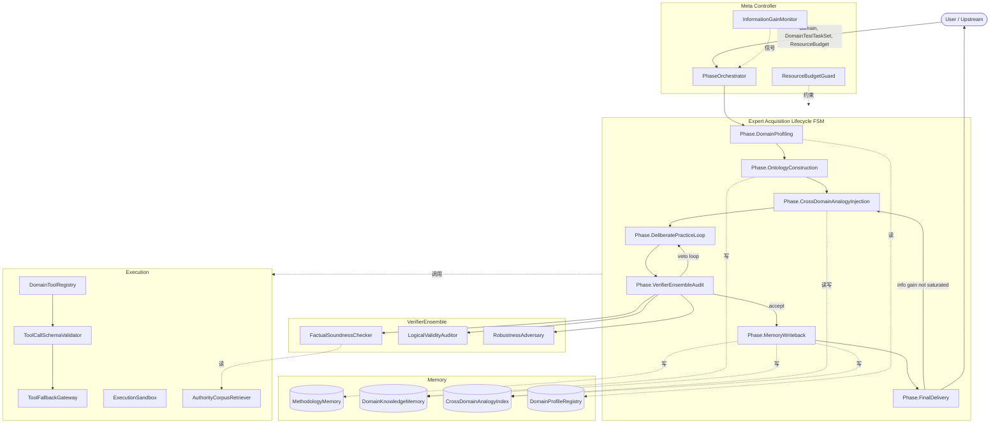

# PRD: Expert-Acquisition Agent System (EAAS)

**Version**: 1.1-spec

**Status**: Engineering-Ready

---

## 1. System Overview

### 1.1 Purpose

将「能在陌生领域内快速成长为专家」的**可形式化元能力**，以**可量化、可验证**方式内置于 LLM-Agent 系统。系统接收：领域规约、测试任务集、资源预算；输出满足领域专家阈值的交付结果。

### 1.2 Job-To-Be-Done (Locked)

Given:

- `domain` ∈ **FormallyVerifiableDomain** ∪ **KnowledgeIntensiveDomain**
- `DomainTestTaskSet`：与该 `domain` 对齐的基准/现实交付任务集
- `ResourceBudget`：`tokenCap` / `roundCap` / `toolCallCap`

Do: 在 `ResourceBudget` 内完成专业能力构建循环。

Deliver: 对 `DomainTestTaskSet` 的解集，使 `TaskPassRate(solutions, DomainTestTaskSet) ≥ DomainExpertThreshold[domain]`。

Oracle（锁定）:

- 公认基准得分 **与**
- 现实任务交付可验证结果

### 1.3 Out-of-Scope（硬边界）

- 无客观 oracle 的开放世界领域 → 拒绝
- 超低延迟（如单次 < 1s）场景 → 非本 PRD 目标
- 以人类主观满意为唯一终止条件 → 拒绝
- 无法绑定 sandbox / verifier 的封闭域 → 拒绝

---

## 2. Glossary & Symbols


| 标识                                        | 全称含义（正文/Schema 使用）                          |
| ----------------------------------------- | ------------------------------------------- |
| `domain`                                  | 待掌握的领域实例                                    |
| `DomainClass`                             | `FormallyVerifiable` 或 `KnowledgeIntensive` |
| `DomainTestTaskSet`                       | 该域的测试任务集合                                   |
| `DomainExpertThreshold[domain]`           | 该域专家级通过阈值（0–1）                              |
| `RoundsToExpertise`（R^*）                  | 首次达阈的轮次数                                    |
| `InformationGainAtRound[n]`（IG_n）         | 第 n 轮信息增益代理量                                |
| `ExpertiseConvergenceQuotient`            | `TasksPassed / TokensConsumed`              |
| `UsefulToolCallRatio`（\eta_{\text{tool}}） | 有用工具调用 / 总工具调用                              |
| `MethodologyMemory`                       | 跨域常驻方法论记忆                                   |
| `DomainKnowledgeMemory`                   | 领域知识记忆                                      |
| `CrossDomainAnalogyIndex`                 | 跨域同构类比索引                                    |
| `VerifierEnsemble`                        | 三角色验证子 Agent 集合                             |


**约定**：R^*、IG_n、\eta_{\text{tool}}、\tau_{\text{domain}} 仅出现于数学块；正文与 JSON 使用上表全称或 camelCase 字段。

---

## 3. System Invariants (Non-Negotiable)


| ID    | 不变量                                                                                  |
| ----- | ------------------------------------------------------------------------------------ |
| INV-1 | 写入 `MethodologyMemory` 必须经 `VerifierEnsemble` 至少 **2/3** `pass`                      |
| INV-2 | `CrossDomainAnalogyIndex` 每条必须含非空 `counterEvidence`                                  |
| INV-3 | 每次工具调用必经 `ToolCallSchemaValidator`                                                   |
| INV-4 | 单 Phase 消耗超过该 Phase 配额的 **110%** → 强制终止该 Phase                                       |
| INV-5 | 进入 `Phase.FinalDelivery` 前，`VerifierEnsemble` 三角色各至少一次 `pass`（历史累计）                  |
| INV-6 | `domain` 未在 `DomainProfileRegistry` 注册 → 强制执行 `Phase.DomainProfiling` 内探测子流程         |
| INV-7 | 总预算 ≥ **90%** 且未达 `DomainExpertThreshold` → 提前交付，`deliveredUnderBudgetCeiling: true` |
| INV-8 | `VerifierEnsemble` 三角色上下文**互不可见**（独立会话）                                              |


---

## 4. Top-Level Architecture

### 4.1 Modules


| Module                     | Responsibility                                                                 |
| -------------------------- | ------------------------------------------------------------------------------ |
| `PhaseOrchestrator`        | Phase 调度、转移条件仲裁                                                                |
| `ResourceBudgetGuard`      | Token / Round / ToolCall 配额                                                    |
| `InformationGainMonitor`   | 信息增益代理、`InformationGainPlateau` 早停                                             |
| `DomainProfileRegistry`    | `domain` → 工具、语料、阈值、oracle 绑定                                                  |
| `AgentMemoryStore`         | `MethodologyMemory` / `DomainKnowledgeMemory` / `CrossDomainAnalogyIndex` 统一接口 |
| `VerifierEnsemble`         | `FactualSoundnessChecker` + `LogicalValidityAuditor` + `RobustnessAdversary`   |
| `DomainToolRegistry`       | 域内工具白名单与 JSON Schema                                                           |
| `ToolCallSchemaValidator`  | 工具入参强校验                                                                        |
| `ToolFallbackGateway`      | 工具失败降级链                                                                        |
| `AuthorityCorpusRetriever` | 权威语料检索与引用追溯                                                                    |
| `ExecutionSandbox`         | 代码/仿真隔离执行                                                                      |


### 4.2 Control-Flow Topology (Mermaid)




---

## 5. Phase Machine Specification

### 5.1 Phases


| Phase                               | Entry         | Exit                                          | Default Token Quota   | ReAct 上限 |
| ----------------------------------- | ------------- | --------------------------------------------- | --------------------- | -------- |
| `Phase.DomainProfiling`             | 新会话或域未注册      | `DomainProfile` 完整或 user-escalate             | 5%（**首次域 +30%** 探测溢价） | 4        |
| `Phase.OntologyConstruction`        | Profile 就绪    | Ontology：`nodeCount ≤ 200` 且 `axiomCount ≥ 5` | 20%                   | 8        |
| `Phase.CrossDomainAnalogyInjection` | Ontology 就绪   | ≥1 有效类比且 `counterEvidence` 非空；或进入无类比模式        | 8%                    | 5        |
| `Phase.DeliberatePracticeLoop`      | 上一 Phase 就绪   | `InformationGainPlateau` 或 round cap 或审核触发    | 30%                   | 12       |
| `Phase.VerifierEnsembleAudit`       | 练习回合产出        | 三角色 `VerifierVerdict` 齐全                      | 15%                   | 每角色 3    |
| `Phase.MemoryWriteback`             | 审核通过（≥2 pass） | 写回提交                                          | 5%                    | 2        |
| `Phase.FinalDelivery`               | 写回完成或 IG 饱和   | `passRate` 达阈或预算 90%                          | 17%                   | 6        |


### 5.2 Transitions

- `Phase.DomainProfiling` → `Phase.OntologyConstruction` 当 `domainProfileReady`
- `Phase.DomainProfiling` → `ABORT(reason: "FM.BootstrapInfeasible")` 当 `profileUnsolvable` 或 `domainProfilingBudgetExceeded110Percent`
- `Phase.OntologyConstruction` → `Phase.CrossDomainAnalogyInjection` 当 `ontologyReady`
- `Phase.CrossDomainAnalogyInjection` → `Phase.DeliberatePracticeLoop` 当 `analogyReady` 或 `noValidAnalogy`（无对比模式）
- `Phase.DeliberatePracticeLoop` → `Phase.VerifierEnsembleAudit` 当 `informationGainPlateauForMConsecutiveRounds` 或 `practiceRoundCapHit`
- `Phase.VerifierEnsembleAudit` → `Phase.MemoryWriteback` 当 `verifierAggregateAccept`（≥2 pass）
- `Phase.VerifierEnsembleAudit` → `Phase.DeliberatePracticeLoop` 当 `verifierAggregateReject`（≥2 veto）或部分重试分支
- `Phase.MemoryWriteback` → `Phase.FinalDelivery` 当 `memoryWritebackCommitted`
- `Phase.FinalDelivery` → `HALT(success)` 当 `passRate ≥ DomainExpertThreshold[domain]`
- `Phase.FinalDelivery` → `Phase.CrossDomainAnalogyInjection` 当 `informationGainNotSaturated` 且 `budgetUtilization < 90%`
- `ANY` → `HALT(deliveredUnderBudgetCeiling: true)` 当 `budgetUtilization ≥ 90%` 且未达阈

默认早停：`InformationGainPlateau` 判定沿用 ε=0.08、m=3，直至实测校准。

### 5.3 Phase Exit Assertions（示意）

- `Phase.DomainProfiling`：`domainProfile.toolsNonEmpty`、`domainProfile.callableOracle`、`domainExpertThresholdInZeroOne`
- `Phase.OntologyConstruction`：`nodeCount ≤ 200`、`axiomCount ≥ 5`、`authorityChunkScore ≥ 0.7`（可配置）
- `Phase.CrossDomainAnalogyInjection`：每条类比 `counterEvidence` 非空；`analogyConfidence ≥ 0.5` 或丢弃
- `Phase.DeliberatePracticeLoop`：至少一条 `PracticeEpisode` 且含 `informationGainProxy`
- `Phase.VerifierEnsembleAudit`：三条 `VerifierVerdict` 且各含 `supportingEvidence`
- `Phase.MemoryWriteback`：`verifierEnsembleSignatures` 至少 2×`pass`
- `Phase.FinalDelivery`：交付物数量与 `DomainTestTaskSet` 对齐；报告 `passRate`

---

## 6. AgentMemoryStore Data Model

### 6.1 `MethodologyMemory`

```jsonc
{
  "schemaVersion": "string",
  "entries": [{
    "entryId": "uuid",
    "primitive": "FirstPrinciplesReduction | CrossDomainIsomorphismMapping | LeverageSourceIdentification | DeliberatePracticeWithFeedback | FailureModeCataloging | QuestionQualityCritique",
    "rule": "string",
    "applicableWhen": "predicateExpression",
    "evidenceEpisodeIds": ["episodeId"],
    "ruleConfidence": 0.0,
    "antipatterns": ["string"],
    "createdAtRound": 0,
    "verifierEnsembleSignatures": {
      "FactualSoundnessChecker": "pass | abstain",
      "LogicalValidityAuditor": "pass | abstain",
      "RobustnessAdversary": "pass | abstain"
    }
  }]
}
```

写入需满足 INV-1。

### 6.2 `DomainKnowledgeMemory`

```jsonc
{
  "domainId": "string",
  "ontology": {
    "nodes": [{"id": "string", "term": "string", "definition": "string", "sourceCitation": "string"}],
    "edges": [{"sourceId": "string", "targetId": "string", "relation": "string"}],
    "axioms": ["string"]
  },
  "toolReliabilityHistory": {
    "toolId": {"successCount": 0, "failureCount": 0, "latencyP95Ms": 0}
  },
  "cataloguedFailureModes": [{
    "pattern": "string",
    "signature": "string",
    "remedy": "string",
    "occurrences": 0
  }],
  "benchmarkState": {
    "currentPassRate": 0.0,
    "domainExpertThreshold": 0.0,
    "roundsSoFar": 0
  }
}
```

### 6.3 `CrossDomainAnalogyIndex`

```jsonc
{
  "analogies": [{
    "analogyId": "uuid",
    "sourceDomainId": "string",
    "targetDomainId": "string",
    "mapping": [{"sourceConcept": "string", "targetConcept": "string", "homomorphism": "bijective | partial"}],
    "analogyConfidence": 0.0,
    "counterEvidence": [{"case": "string", "whyBreaks": "string"}],
    "successfulApplicationEpisodeIds": ["episodeId"],
    "failedApplicationEpisodeIds": ["episodeId"]
  }]
}
```

查询接口：`queryCrossDomainAnalogy(targetDomainId, targetProblem, topK)` → 仅返回 `analogyConfidence ≥ 0.5` 且 `counterEvidence` 非空；并注入强制反证 prompt（规划假设：Token 溢价约 +15%）。

---

## 7. VerifierEnsemble API Specification

### 7.1 Request / Response

**Request**

```jsonc
{
  "verifierRole": "FactualSoundnessChecker | LogicalValidityAuditor | RobustnessAdversary",
  "auditSubject": {
    "subjectType": "ontology | analogy | practiceEpisode | deliverable",
    "subjectPayload": {},
    "domainId": "string"
  },
  "evidencePack": {
    "authorityCorpusChunks": [],
    "reasoningTrace": "string",
    "adversarialEdgeCases": []
  },
  "auditBudget": {"maxTokens": 0, "maxRounds": 0}
}
```

- `FactualSoundnessChecker` 主要消费 `authorityCorpusChunks`
- `LogicalValidityAuditor` 主要消费 `reasoningTrace`
- `RobustnessAdversary` 主要消费 `adversarialEdgeCases`

**Response**

```jsonc
{
  "verifierRole": "string",
  "verdict": "pass | veto | abstain",
  "verdictConfidence": 0.0,
  "supportingEvidence": [{"claim": "string", "citationOrTrace": "string"}],
  "refutingEvidence": [{"claim": "string", "citationOrCase": "string"}],
  "actionableFeedbackForRetry": "string",
  "tokensUsed": 0
}
```

### 7.2 Role Mandates（摘要）


| Role                    | 唯一职责             | 禁止越权           |
| ----------------------- | ---------------- | -------------- |
| FactualSoundnessChecker | 事实声明可追溯权威源；无源即可疑 | 不审逻辑链；不构造对抗    |
| LogicalValidityAuditor  | 逐步检验推理有效性        | 不挑战事实；不构造对抗    |
| RobustnessAdversary     | 构造边界/对抗场景试图破坏方案  | 不替代事实稽查；不做形式证明 |


### 7.3 Aggregate Verdict

```
if vetoCount ≥ 2 → REJECT
else if passCount ≥ 2 → ACCEPT
else if vetoCount == 1 && passCount ≥ 1 → PARTIAL_RETRY
else → ABSTAIN_ESCALATE
```

---

## 8. DomainToolRegistry & ToolFallbackGateway

### 8.1 Per-Domain Tool Entry

```jsonc
{
  "domainId": "string",
  "tools": [{
    "toolId": "string",
    "category": "executor | retriever | simulator | validator",
    "inputJsonSchema": {},
    "isPrimary": true,
    "secondaryFallbackForToolId": "string | null",
    "expectedLatencyP95Ms": 0,
    "authentication": "required | optional | none"
  }]
}
```

### 8.2 Fallback Stages（每次调用）

1. Primary tool
2. `RepairPrompt`（1 次，修正参数）
3. Secondary tool（若注册）
4. Degraded LLM-only（`executedInDegradedMode: true`）
5. User escalation

### 8.3 Trigger → Action（摘录）


| Trigger         | Action                                                  |
| --------------- | ------------------------------------------------------- |
| Schema 校验失败     | RepairPrompt；`toolReliabilityHistory.failureCount += 1` |
| 超时 `> 2 × p95`  | 切换 secondary                                            |
| 5xx / panic     | 切换 secondary                                            |
| 召回置信度 < 0.4     | 扩大 `topK` / BroaderSearch                               |
| Verifier 双 veto | 回 `Phase.DeliberatePracticeLoop` 并注入反馈                  |
| 预算 90% 未达阈      | 强制 `Phase.FinalDelivery`，INV-7                          |


---

## 9. DomainProfileRegistry & `Phase.DomainProfiling`

### 9.1 `DomainProfile`

```jsonc
{
  "domainId": "string",
  "domainClass": "FormallyVerifiable | KnowledgeIntensive",
  "oracleBinding": {
    "oracleKind": "benchmark | deliveryCheck | both",
    "benchmarkIds": ["string"],
    "deliveryValidatorCallableId": "string"
  },
  "domainExpertThreshold": 0.0,
  "recommendedToolIds": ["string"],
  "authoritySources": [{"uri": "string", "weight": 0.0}],
  "bootstrapStatus": "registered | probed | unknown"
}
```

### 9.2 Probing Subphase（首次域 +30% Token）

1. Lookup `DomainProfileRegistry`
2. Miss → 运行探测：域类识别、公开 benchmark 候选、`DomainToolRegistry` 过滤、**AuthorityCorpusRetriever** 试召
3. 草稿 `DomainProfile` → 以 `LogicalValidityAuditor` 为主导的快速校验
4. 写回，`bootstrapStatus: probed`
5. 若无 oracle 与工具候选 → `FM.BootstrapInfeasible`

SLA 类量级（待实测）：`FormallyVerifiable` 的 `RoundsToExpertise` 上界约为 `8 × log|DomainTestTaskSet|`；`KnowledgeIntensive` 约为 `24 × log|DomainTestTaskSet|`。

---

## 10. Metrics


| Metric                         | Definition                                                | Collection       |
| ------------------------------ | --------------------------------------------------------- | ---------------- |
| `RoundsToExpertise`            | R^* = \arg\min_n \text{holdout pass} \ge \text{threshold} | Audit / Final    |
| `InformationGainAtRound`       | IG_n：ontology 节点增量与有效类比增量的加权和代理                           | Practice         |
| `ExpertiseConvergenceQuotient` | `passedTasks / tokensConsumed`                            | Final            |
| `UsefulToolCallRatio`          | 被下游实际消费的调用 / 总调用                                          | Practice / Final |
| `TaskPassRate`                 | 通过任务数 / `|DomainTestTaskSet|`                             | Final            |
| `VerifierTruePositiveRate`     | 经 ground truth 认可的 veto / 总 veto                          | Audit            |


---

## 11. Failure Mode → Disposition


| ID                                | Condition              | Disposition                       |
| --------------------------------- | ---------------------- | --------------------------------- |
| FM.BootstrapInfeasible            | 探测无 oracle/tool        | `ABORT` + 上报                      |
| FM.OntologyNodeOverflow           | `nodeCount > 200`      | 聚类压缩 + 重做 OntologyConstruction 一次 |
| FM.AllAnalogiesLowConfidence      | 无合格类比                  | 跳过类比注入                            |
| FM.PracticeNoInformationGain      | plateau 检测触发           | 强制进入 VerifierEnsembleAudit        |
| FM.VerifierEnsembleDoubleVetoLoop | 同 episode ≥3 次双否决      | 标记 dead-end；刷新类比                  |
| FM.BudgetExhausted                | ≥90% 预算                | `deliveredUnderBudgetCeiling`     |
| FM.ToolChainTotalFailure          | 降级链到 escalation        | 用户升级                              |
| FM.CorpusPollution                | 引用追溯反复失败               | 暂停 source；重召                      |
| FM.MisleadingAnalogy              | `failedApplication` 占优 | 将该条 `analogyConfidence → 0`       |
| FM.MethodologySedimentConflict    | 方法论条目互斥                | `VerifierEnsemble` 仲裁；必要时双版本并存    |


---

## 12. Data-Flow Contracts


| Object                 | Producer                    | Consumer                 | Drop-if             |
| ---------------------- | --------------------------- | ------------------------ | ------------------- |
| `DomainProfile`        | DomainProfiling             | Ontology, Audit, Final   | oracle 缺失           |
| `DomainOntology`       | OntologyConstruction        | Analogy, Practice, Audit | `nodeCount` 超限      |
| `CrossDomainAnalogy`   | CrossDomainAnalogyInjection | DeliberatePractice       | `counterEvidence` 空 |
| `PracticeEpisode`      | DeliberatePracticeLoop      | Audit, Writeback         | 无 IG 代理             |
| `VerifierVerdict`      | VerifierEnsembleAudit       | Writeback / Retry        | 无证据                 |
| `MemoryWritebackDelta` | MemoryWriteback             | AgentMemoryStore         | 未过 INV-1            |
| `DomainDeliverable`    | FinalDelivery               | User                     | —                   |


---

## 13. Capability Gates (Agent-Native Milestones)


| Gate                                    | Done-Definition                                                                 |
| --------------------------------------- | ------------------------------------------------------------------------------- |
| Gate.SkeletonFSMWalking                 | Mock registry 上 Phase 全路径可跑；转移日志完整；预算不越界                                        |
| Gate.VerifierEnsembleOnline             | 三角色独立会话；仲裁全覆盖；INV-8 审计通过                                                        |
| Gate.SingleFormallyVerifiableDomainMVP  | 单一参考域端到端 `TaskPassRate` 达阈                                                      |
| Gate.MemoryWritebackClosed              | MemoryWriteback Phase 写回全链路；首条经 `VerifierEnsemble` 通过的 `MethodologyMemory` 条目落库 |
| Gate.CrossDomainAnalogyCompounding      | 第二参考域 `ExpertiseConvergenceQuotient ≥ 1.3×` 第一域                                 |
| Gate.KnowledgeIntensiveDomainSupport    | 引用追溯完整；一参考域达 `KnowledgeIntensive` SLA                                           |
| Gate.FailureModeCoverageComplete        | FM.* 全自动检测+处置；混沌测试 ≥95%                                                         |
| Gate.MultiDomainConcurrencySafe         | ≥3 `domain` 并发；类比索引写无冲突                                                         |
| Gate.SelfImprovementEmpiricallyVerified | 固定域重复 N 次，末次 `RoundsToExpertise` < 首次 × 0.7                                     |


---

## 14. Validation Plan

- **单元**：转移表覆盖；`ResourceBudgetGuard` 边界；`ToolCallSchemaValidator` 四类拒绝；单角色 `VerifierTruePositiveRate`
- **集成**：端到端 mock/real；四类聚合判决可达；`ToolFallbackGateway` 五阶段
- **系统**：多参考域 SLA
- **对抗**：污染语料、逻辑跳跃、对抗输入、误导类比 + 反证机制

---

## 15. Open Risks


| ID  | Risk                          | Mitigation                               |
| --- | ----------------------------- | ---------------------------------------- |
| R-1 | 同模型多 prompt 角色相关性偏高           | Gate.VerifierEnsembleOnline 后测 ρ，必要时异构模型 |
| R-2 | `InformationGainAtRound` 为熵代理 | ε、m 可调；对照实验                              |
| R-3 | `DomainProfileRegistry` 冷启动成本 | Mock + Probing                           |
| R-4 | `MethodologyMemory` 长期偏置      | 定期 prune；冲突双版本                           |
| R-5 | 权威语料时效                        | `validUntil` 元数据                         |
| R-6 | Verifier catch 率先验未校准         | 仪表化回填                                    |


---

## 16. Appendix: Reusable Patterns

### A.1 `VerifierEnsembleSizing`（脱域）

1. 枚举失效模式
2. 相关性聚类 → 正交簇数 K
3. 估计每簇检出率 p
4. 边际覆盖 \Delta P(n) = (1-p)^{n-1} p，拐点 \Delta P(n)/\Delta P(n-1) < 0.4
5. `N = min(n*, K)`；每簇一角色；上下文隔离

### A.2 误差正交三轴

- **FactualSoundness** → `FactualSoundnessChecker`
- **LogicalValidity** → `LogicalValidityAuditor`
- **Robustness** → `RobustnessAdversary`

### A.3 Agent-Native Speed Quadruple

`RoundsToExpertise`、`InformationGainAtRound`、`ExpertiseConvergenceQuotient`、`UsefulToolCallRatio`